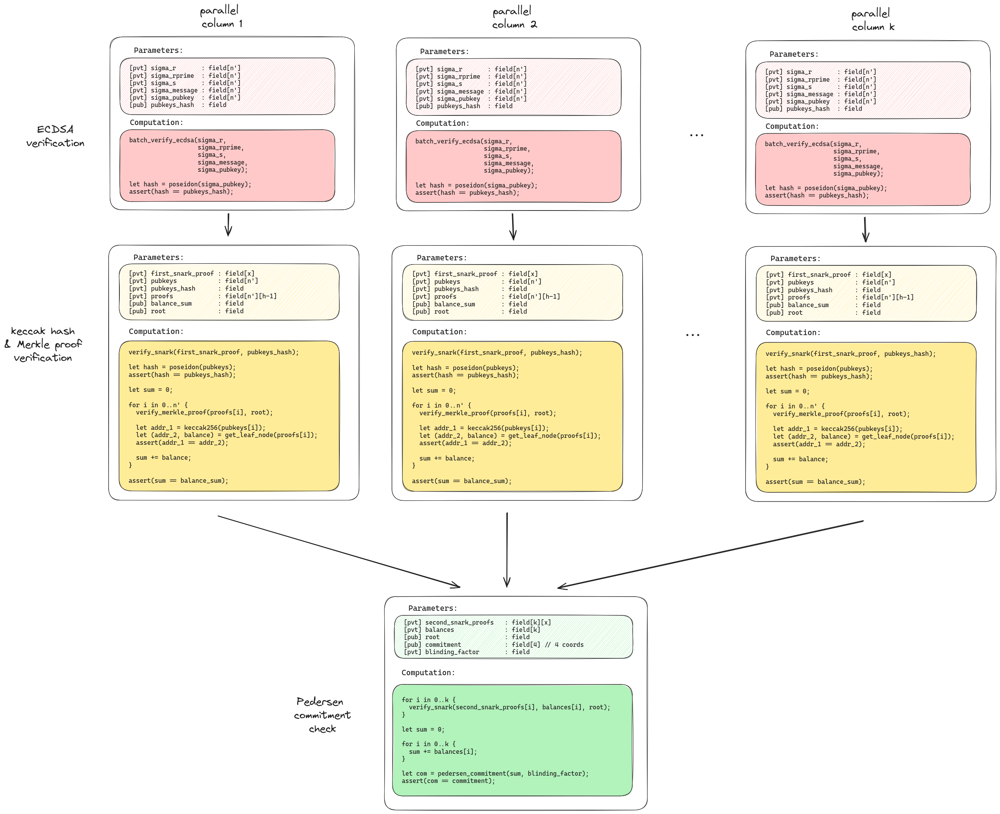

# ZK Proof of Assets

Circom & Groth16 SNARK implementation of Proof of Assets. This repo allows digital asset custodians (such as cryptocurrency exchanges) to prove that they own a certain amount of digital assets, without revealing the addresses that hold the assets. Proof of Assets is the first out of 2 protocols that make up a Proof of Reserves protocol; the other protocol is Proof of Liabilities (repo [here](https://github.com/silversixpence-crypto/dapol). 
1. For details on the whole PoR project see [this project doc](https://hackmd.io/@JI2FtqawSzO-olUw-r48DQ/S1Ozo-iO2).
2. For the original Proof of Assets design doc see [this](https://hackmd.io/@JI2FtqawSzO-olUw-r48DQ/rJXtAeyLT). Note, however, that the final design is slightly different to the original (some optimizations were done). See below for final design.
3. For an in-depth explanation of Proof of Assets see [this article](https://hackmd.io/@JI2FtqawSzO-olUw-r48DQ/r1FR-0uBR).

## Brief overview of PoA

The above-linked docs offer an in-depth explanation, but here is a brief one:

Problem statement: a crypto-asset custodian wants to prove they own $X$ digital assets, but do not want to reveal the addresses that hold the assets.

Solution: the custodian produces signatures for the addresses (which forms the ownership proof), and feeds them as private inputs to a ZK-SNARK, which verifies them and checks that they are contained within a larger set of addresses (the anonymity set). This set is a public input to the snark and must be checked to mirror the blockchain by the verifier. Finally, the snark adds up the balances of the addresses, and outputs a Pedersen commitment of the sum. The commitment is public and can be used in conjunction with 

## Current state

***No audit has been done yet***

The code is working as of June 2024 and can be used as is. It only works for EVM blockchains, but it is possible to support other chains.

See [the high priority task list](https://github.com/silversixpence-crypto/zk-proof-of-assets/issues?q=is%3Aissue+is%3Aopen+label%3Apriority%3Ahigh) for some important outstanding issues.

The code is at it's first stage: Groth16 & Circom libraries. Second stage involves using different proving systems & libraries for ECDSA verification to gain [hopefully] ~1000x in performance. Track progress here: https://github.com/silversixpence-crypto/zk-proof-of-assets/issues/23

## Design

There is a system of snarks, seperated into 3 layers and linked via snark recursion. The was done to increase the total number of signatures that can be supported (see design doc for more details).

Inputs to the system (produced by the custodian):
- set of ECDSA signatures & account balances (will be a private input to the snarks)
- anonymity set of addresses (public input to the snarks)

Output of the system
- Pedersen commitment to the sum of balances related to the ECDSA signatures

<details>

<summary>Diagram showing recursive snark design for ECDSA signatures</summary>



</details>

## Usage

### Prover

The code has only been tested on a Linux machine (Debian).

First, you'll need to install some software. There is a script that does all of this for you: [machine_initialization.sh](./scripts/machine_initialization.sh). **The script only works on a Debian machine.** It does some invasive changes to the machine (like changing `vm.max_map_count` in `sysctl`) so it is recommended to run it on a server and not your personal machine; running it in a Docker container is also an option. You can find out more about what this script does [here](https://github.com/silversixpence-crypto/zk-proof-of-assets/tree/stent/readme/scripts#machine-initialization).

Next, you run the [full workflow](./scripts/full_workflow.sh) script, which will run the entire snark proving system. The anonymity set and signuture set will have to be given as input to the script, so these need to be generated first. You can read more about the script and it's inputs [here](https://github.com/silversixpence-crypto/zk-proof-of-assets/tree/stent/readme/scripts#machine-initialization).

Here are some useful commands to copy:
```bash
# Run a docker container:
id=$(docker run --privileged -d -ti -m 100G --memory-swap -1 --name poa_100g --rm ubuntu /bin/bash)
# - `-m` : set max memory (-1 for unlimited), which can be useful if you want to use the machine for other tasks, and you know the zk workflow will take up all the memory
# - `--memory-swap` : max swap (-1 for unlimited)
# - `--privileged` : is needed to change vm.max_map_count (see machine_initialization.sh script)

# Copy over the init script to the container:
wget https://raw.githubusercontent.com/silversixpence-crypto/zk-proof-of-assets/main/scripts/machine_initialization.sh
docker cp ./machine_initialization.sh $id:/home

docker attach $id

# =====================================
# Now in container..

# Make sure the system is up to date:
apt update -y && apt upgrade -y && apt install -y sudo vim

# Run the init script:
cd /home && ./machine_initialization.sh -r /root -P -S

# Run the proving system:
cd /root/zk-proof-of-assets
./full_workflow.sh \
    $signatures_file \
    $anon_set_file \
    $blinding_factor
```

#### Powers of Tau

The ptau files can be manually downloaded from the [snarkjs GH](https://github.com/iden3/snarkjs?tab=readme-ov-file#7-prepare-phase-2), but are also automatically downloaded by the machine_initialization script. These files are used as a 'safe' source of randomness for the proving key generation phase (read more [here](https://github.com/weijiekoh/perpetualpowersoftau)).

#### Anonymity set

The anonymity set must be created by the prover, and then made public. One way to create this set is to take the top N accounts of a blockchain (ranked by holdings of the digital asset).

[Here](https://github.com/blockchain-etl/public-datasets) is a list of datasets for various blockchains. This is how to use the [BigQuery dataset for Ethereum](https://console.cloud.google.com/marketplace/product/ethereum/crypto-ethereum-blockchain) to get an anonymity set size of the top 10M Ethereum addresses (ranked by ETH held):
1. Select "VIEW DATASET"
2. Under the *crypto_ethereum* tab you will find the *balances* table, where you can use this SQL query to get the top 10M addresses:
```sql
SELECT * FROM `bigquery-public-data.crypto_ethereum.balances` ORDER BY eth_balance DESC LIMIT 10000000
```
3. 10M winds up being ~600MB, which you can add to your Drive (without paid API access) and then download.

### Verifier

Verification can be done with the [snarkjs](https://github.com/iden3/snarkjs) tool:
```bash
snarkjs groth16 verify ./path/to/vkey.json ./path/to/public_inputs.json ./path/to/proof.json
```

All 3 of the inputs to the script need to be provided by the prover.

## Patches

The [init script](./scripts/machine_initialization.sh) applies a few patches to the submodules.

### [batch-ecdsa patch](./batch-ecdsa.patch)

Workaround for a problem in the circom compiler: https://github.com/iden3/circom/issues/230

### [ed25519-circom patch](./ed25519-circom.patch)

There are conflicts with function names between ed25519-circom and other dependencies, so the patch renames the functions.

## Performance

Most of the time taken up by the workflow is in generating the proving keys (zkeys). These can take hours, days or weeks to generate, depending on the memory capacity of the machine & the size of the input to the workflow. The good thing is that, once the keys are generated, they can be reused. So, one only needs to generate them once, and then they can be used for any number of proofs going forward (as long as the size of the inputs stay the same).

### Constraints

For layer 1, the number of non-linear constraints can be estimated with the following equation: 
$$C_{\text{layer 1}}(s) = 447044s + 888502$$
where $s$ is the number of signatures. This equation was calculated using a line of best fit from the test data (`(num_sigs, constraints)`):
```
[(1, 1509221), (2, 1932908), (2, 1932908), (4, 1932908), (7, 4161827), (16, 8173925), (128, 58102853)]
```

For layer 2, the number of non-linear constraints can be estimated with the following equation: 
$$C_{\text{layer 2}}(s,h) = 159591s + 6054h + 19490640$$
where $h$ is the height of the Merkle tree. Note that the main source of constraints in the layer 2 circuit comes from Groth16 verification.  This equation was calculated using a line of best fit from the test data (`(num_sigs, height, constraints)`):
```
[(4, 12, 19981480), (1, 5, 19823616), (2, 25, 19987876), (7, 25, 20784765), (16, 25, 22219209), (128, 25, 40070665)]
```

## Testing

Related issue: https://github.com/silversixpence-crypto/zk-proof-of-assets/issues/22

There are scripts in the *tests* directory for running the tests. The have the format `N_sigs_K_batches_H_height.sh`. The tests can take many hours to run, depending on the test & the size of the machine running them. The results from running the tests can be found in the directory under *tests* with the same name as the shell script. The *tests/old* directory contains tests that were run using a slightly older version of the workflow (same circuits, different scripts).

There are only integration tests, no unit tests. The reason for this is that the whole system might change in the next version, so writing lots of unit tests is a bit of a waste of time. The unit tests would be there to catch any bugs introduced with future changes, but if there are to be no future changes to the current system then the unit tests are a waste. We already have integration tests to make sure that no bugs are present with the current workflow. 


